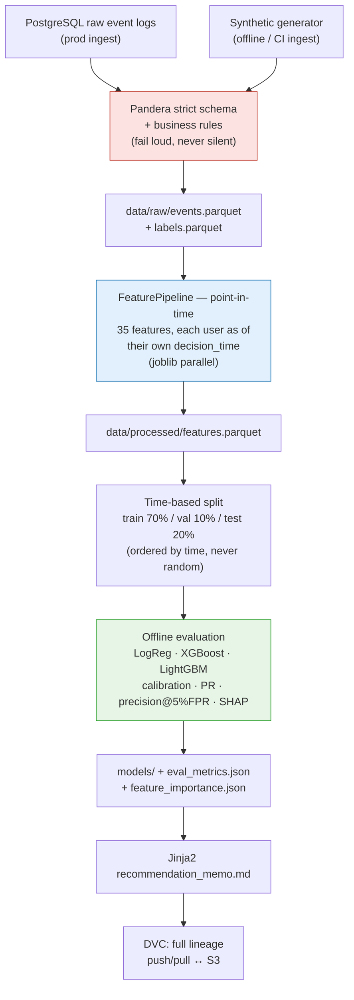
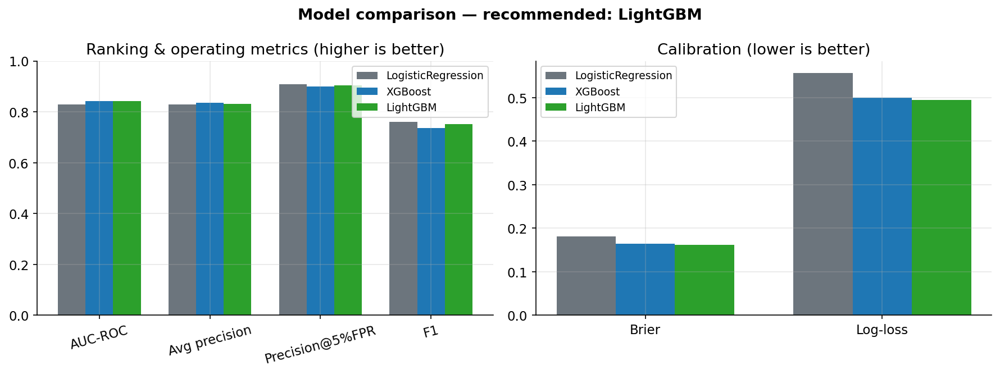
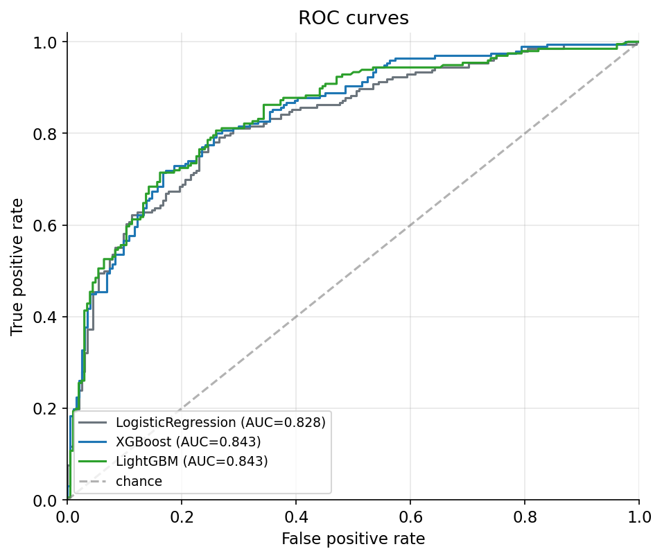
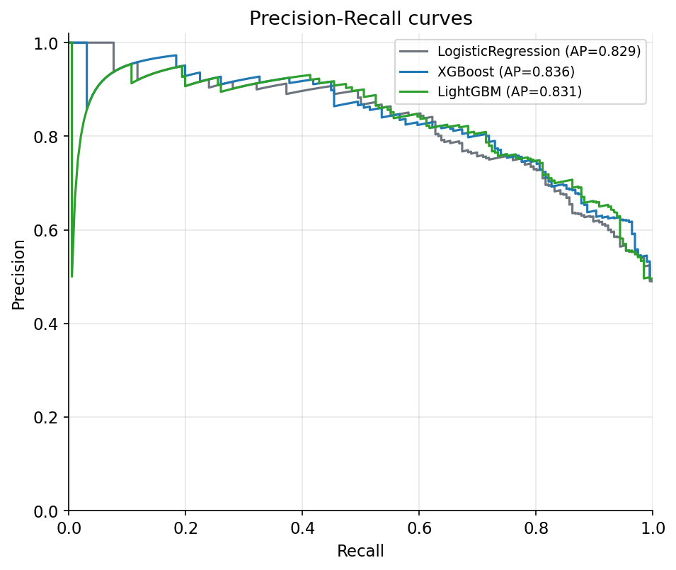
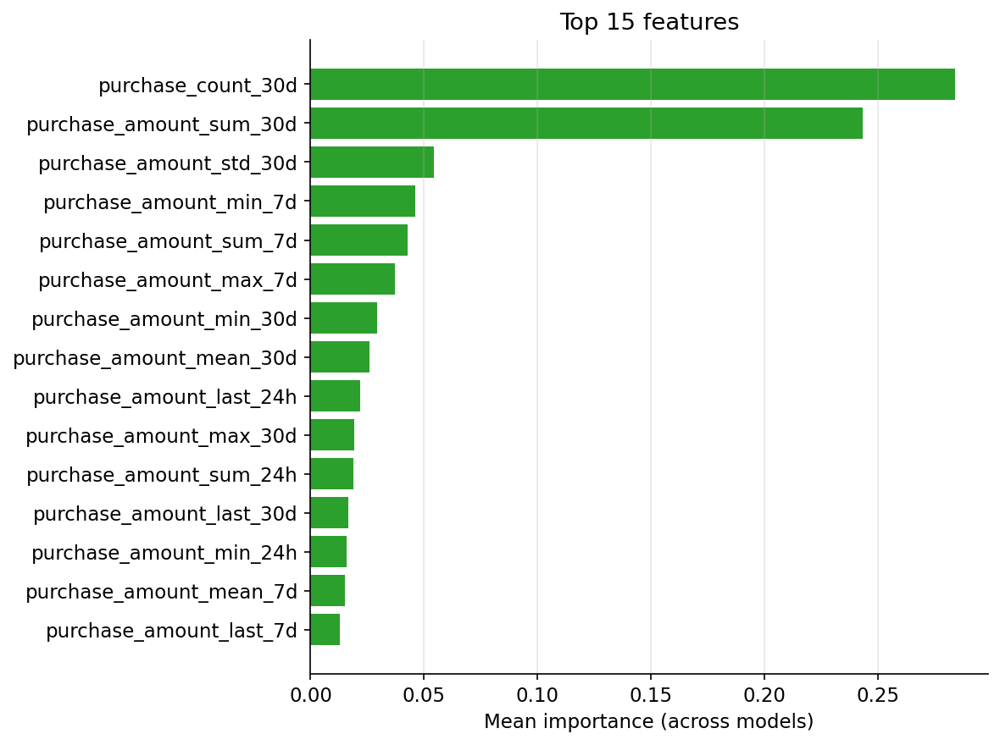
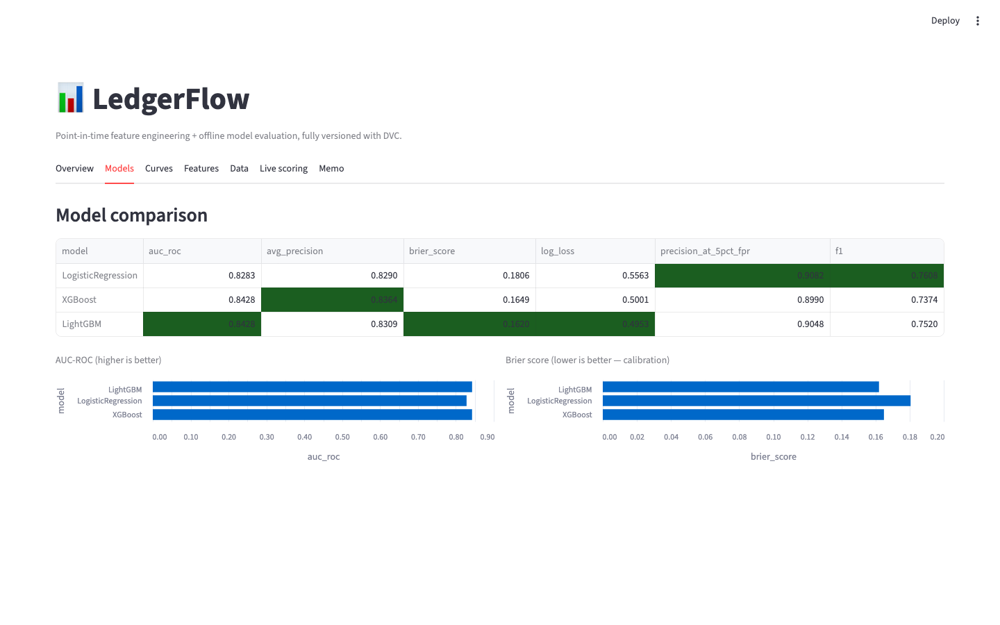

# LedgerFlow

**A modular, tested, and fully reproducible feature-engineering and model-evaluation pipeline that turns raw event logs into machine-learning-ready signals — and a data-driven model recommendation.**

`Python` · `scikit-learn` · `XGBoost` · `LightGBM` · `SHAP` · `Pandera` · `DVC` · `Streamlit` · `GitHub Actions`

---

## What it is

LedgerFlow is a Python **library** (not a notebook, not a script) that solves a
common real ML problem — **binary classification over event-stream data** (think
fraud / churn / conversion from a user's `purchase` / `login` / `view` / `click`
history). The model is almost the easy part. The hard parts — which this project
solves *structurally* — are:

1. **Feature velocity & correctness** — many behavioural features, each independently tested, added in minutes.
2. **No training-serving skew** — the exact same code computes features for training and inference.
3. **No temporal leakage** — features are computed *point-in-time* and splits are *time-based*, never random.
4. **Reproducibility & lineage** — every artifact (data → features → model → metrics) is versioned and reproducible bit-for-bit.

---

## Architecture



Each box is a DVC stage (`ingest → featurize → split → evaluate → report`). DVC
content-hashes every input, so a stage re-runs only when something it depends on
changes — and `dvc.lock` captures exact lineage from raw data to the final memo.

---

## Results

On the bundled synthetic dataset (2,000 users, ~33k events), all three models are
trained, evaluated on a held-out test set, and compared on **ranking** *and*
**calibration**. The recommendation is chosen by the data, not by intuition.



Because the model emits **probabilities**, calibration matters as much as ranking
— a model can rank well (high AUC) yet be a poor probability estimator (high
Brier). Reporting both prevents shipping the wrong thing.

<p align="center">
  
  
</p>

Feature importance is computed with **SHAP** for the tree models (consistent,
game-theoretic attributions) and standardised coefficients for logistic
regression, then averaged across models. Features below an importance threshold
are auto-flagged as removal candidates.



> The recommendation memo (`reports/recommendation_memo.md`) is **auto-generated**
> from these metrics on every run — never written by hand.

---

## Interactive dashboard

A Streamlit dashboard visualises every output and includes a **live-scoring** tab
that scores a single user through the *same* point-in-time feature code used in
training — a direct, visible demonstration of the no-skew design.



```bash
pip install -e ".[dashboard]"
streamlit run dashboard/app.py        # run `dvc repro` first so artifacts exist
```

Tabs: Overview · Models · Curves · Features · Data · **Live scoring** · Memo.

---

## The 35 features

5 time windows × 7 aggregations over purchase events, all produced by one
parameterised class on a shared `BaseFeature` contract:

| | |
|---|---|
| **Windows** | `1h` · `6h` · `24h` · `7d` · `30d` |
| **Aggregations** | `count` · `sum` · `mean` · `std` · `min` · `max` · `last` |

Each feature self-registers in a catalog; CI fails if a pipeline feature isn't
registered (code and docs can't drift). Adding a new feature is a scaffold away:

```bash
python scripts/new_feature.py --name session_count_24h --window 24h \
  --description "Distinct sessions in the last 24h"
# → generates a BaseFeature subclass + a test stub; implement compute(), run pytest. ~20 min.
```

---

## Quick start

```bash
# 1. Install (Python 3.10+)
python -m venv .venv && source .venv/bin/activate
pip install -e ".[dev]"

# 2. Reproduce the whole pipeline offline (synthetic ingest — no database needed)
dvc repro                          # ingest → featurize → split → evaluate → report

# 3. See the results
dvc metrics show
cat reports/recommendation_memo.md

# 4. Regenerate the README charts (optional)
pip install -e ".[notebooks]" && python scripts/make_readme_assets.py
```

> **Data source:** the DVC `ingest` stage uses a deterministic synthetic generator
> (`LedgerFlow.data.synthetic`) so `dvc repro` and CI run without a database. In
> production this stage is swapped for the PostgreSQL loader
> (`LedgerFlow.data.loader`); both emit the same Pandera-validated schema.

---

## Project structure

```
LedgerFlow/
├── LedgerFlow/
│   ├── params.py            # params.yaml loader
│   ├── registry.py          # feature catalog + metadata
│   ├── pipeline.py          # FeaturePipeline (batch / point-in-time / single-user)
│   ├── data/
│   │   ├── loader.py        # PostgreSQL loader (production ingest)
│   │   ├── synthetic.py     # offline synthetic event-log generator
│   │   ├── validators.py    # Pandera schema + business rules
│   │   ├── ingest.py        # Postgres → Parquet orchestrator
│   │   └── splitter.py      # time-based train/val/test split
│   ├── features/
│   │   ├── base.py          # BaseFeature abstract contract
│   │   └── time_windows.py  # the 35 time-window features
│   └── evaluation/
│       ├── metrics.py       # AUC, Brier, log-loss, precision@FPR, SHAP helpers
│       ├── compare.py       # multi-model comparison runner
│       ├── report.py        # Jinja2 memo generator
│       └── templates/
├── dashboard/               # Streamlit app + testable loaders
├── scripts/                 # new_feature scaffold, reproduce, README assets
├── notebooks/               # executed EDA + feature analysis
├── tests/{unit,integration}/
├── dvc.yaml                 # the 5-stage pipeline
├── params.yaml              # all configurable parameters
└── .github/workflows/ci.yml
```

---

## Engineering & reproducibility

| | |
|---|---|
| **Tests** | 246 tests (214 unit), incl. a training-serving **parity test** (batch vs single-user to 1e-6), a point-in-time parity test, and a 10K-row <30s benchmark. **97% coverage** (90% gate in CI). |
| **Static checks** | `ruff` + `mypy` on every PR. |
| **CI** | GitHub Actions: `test` (coverage gate + real `dvc repro`), `integration-db` (live `postgres:16` service), `lint`, `feature-registry`. |
| **Reproducibility** | Seeded data + fixed seeds → `features.parquet` is **byte-identical** across runs; `dvc repro` reproduces the full pipeline from a clean checkout. |
| **Versioning** | DVC tracks data, features, splits, models, and metrics; `dvc push/pull` syncs to an S3 remote. |
| **Governance** | `main` is protected (PR + review + all checks required). |

---

## Techniques at a glance

- **Single `compute()` path** → no training-serving skew (enforced by a CI parity test).
- **Point-in-time featurization** → each user as of their own `decision_time`, so no feature leaks post-decision information.
- **Time-based split** → train on the past, test on the future; random splits are forbidden.
- **Pandera at the boundary** → bad data fails loudly at ingestion, never silently downstream.
- **DVC pipeline + content hashing** → reproducible lineage and cached re-runs.
- **SHAP importance + low-signal flagging** → an automatic feature-pruning feedback loop.

---

## Honest limitations

- Runs on a **synthetic event log** — the Postgres path is real and tested, but no production data flowed through it.
- The memo **recommends** a model for an A/B test; **no A/B test was run** and nothing was deployed.
- It's a DVC-versioned **feature matrix**, not a dedicated feature-store framework.

---

## License

MIT
